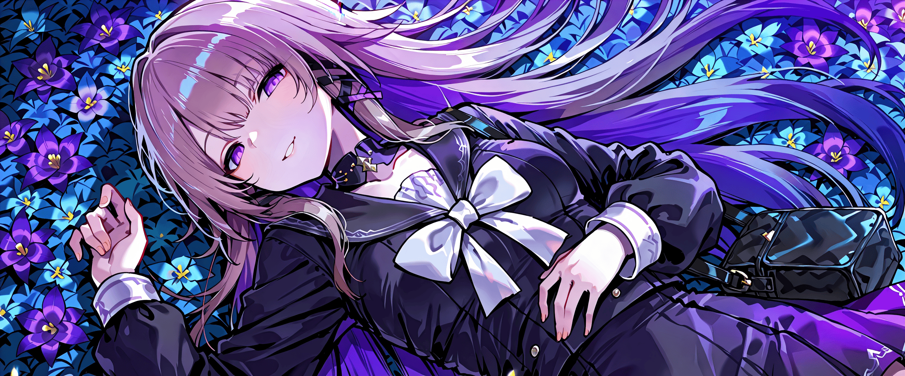
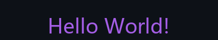
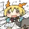
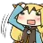

  

<!-- Glitch Header GIF -->

 

---

 

<!-- Typing SVG: Purple #a45ee5 -->

 

-  **Unity Technical Artist & Creative Developer**
-  Bridging the gap between **art** and **code**
-  Creating immersive experiences with **Unity**, **Shaders**, and **WebGL**
-  Check out my projects below!

 

<!-- Tech Stack: Minimalist Icons -->

  

 

<!-- Stats Section: Vertical Stack with "radical" theme for Anime Aesthetic -->

  

 

  

 

  

 

  

 

<!-- Herta Theme Activity Graph -->
  
